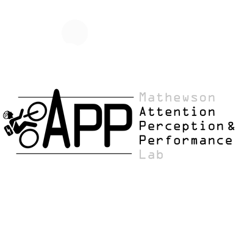

### [<i class="fas fa-file-pdf"></i> View PDF Copy](Resume.pdf)

## Experience

<table>
    <thead>
        <tr>
            <th>Company</th>
            <th>Link</th>
            <th>Role</th>
            <th>Dates</th>
            <th>Location</th>
        </tr>
    </thead>
    <tbody>
        <tr>
            <td></td>
            <td><a href="https://fatiguescience.com/" target="_blank">Fatigue Science</a></td>
            <td>Junior Software Engineer</td>
            <td>Sept 2021 - Aug 2022</td>
            <td>Vancouver, Canada</td>
        </tr>
        <tr>
            <td></td>
            <td><a href="https://blueberryx.com/" target="_blank">Blueberry</a></td>
            <td>Junior Researcher</td>
            <td>Jul 2021 - Sept 2021</td>
            <td>Toronto, Canada</td>
        </tr>
        <tr>
            <td></td>
            <td><a href="https://sites.psych.ualberta.ca/kylemathewson/" target="_blank">APP Lab – University of Alberta</a></td>
            <td>Undergraduate Research Assistant</td>
            <td>May 2019 - Sept 2019</td>
            <td>Edmonton, Canada</td>
        </tr>
    </tbody>
</table>

---

## Volunteer

<table>
    <thead>
        <tr>
            <th>Organization</th>
            <th>Link</th>
            <th>Role</th>
            <th>Dates</th>
            <th>Location</th>
        </tr>
    </thead>
    <tbody>
        <tr>
            <td></td>
            <td><a href="https://www.aimss.ca/" target="_blank">Artificial Intelligence in Medical Systems Society</a></td>
            <td>Treasurer / Event Operations Manager</td>
            <td>Dec 2019 - Feb 2021</td>
            <td>Edmonton, Canada</td>
        </tr>
        <tr>
            <td></td>
            <td><a href="https://www.teamupscience.com/" target="_blank">TeamUp Science</a></td>
            <td>Director of Computer Science / Teaching Assistant</td>
            <td>Sept 2019 - Feb 2021</td>
            <td>Edmonton, Canada</td>
        </tr>
    </tbody>
</table>

---

## Education

<table>
    <thead>
        <tr>
            <th>School</th>
            <th>Link</th>
            <th>Degree</th>
            <th>Graduation</th>   
            <th>Location</th>
        </tr>
    </thead>
    <tbody>
        <tr>
            <td></td>
            <td><a href="https://www.ualberta.ca/index.html" target="_blank">University of Alberta</a></td>
            <td>BSc, Computing Science</td>
            <td>2024</td>
            <td>Edmonton, Canada</td>
        </tr>
    </tbody>
</table>